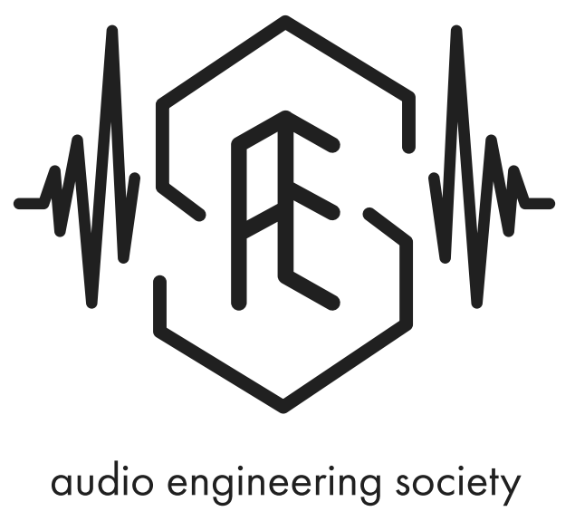

# Welcome

The Cal Poly Audio Engineering Society is passionate about engineering and making noises! We build speakers, cables, amplifiers, synthesizers, FX pedals, and more!

Check out a [general meeting]({{ site.baseurl }}) if you're interested in joining the club. 

Meetings are every **Thursday, 11am - noon in Engineering East (20-126)**.

You can also sign up for our email list [here](https://docs.google.com/forms/d/e/1FAIpQLScl111xpuY-Dq-CbbroBFxpobSQrxx93FEPhlQBwfQqdcBCTA/viewform?usp=sf_link).